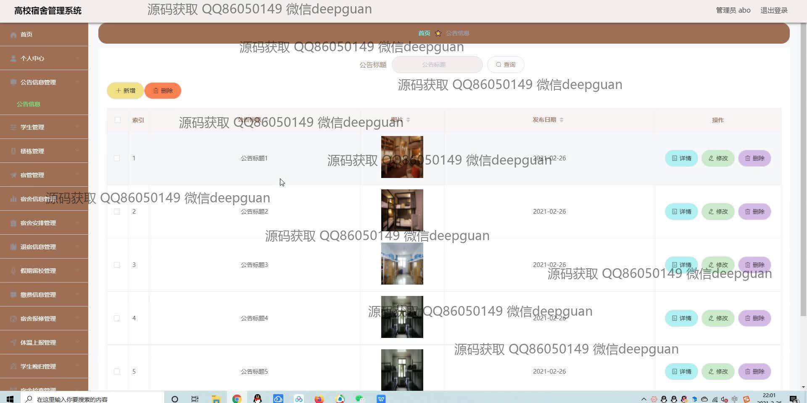
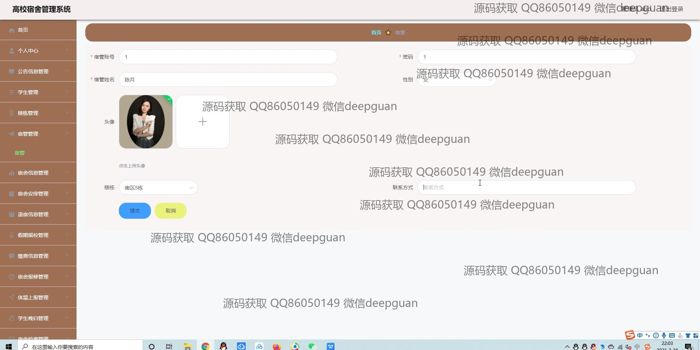
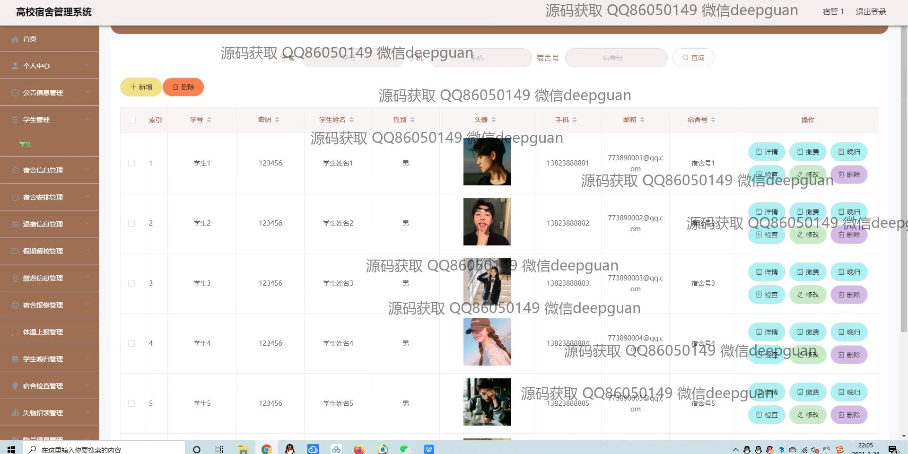
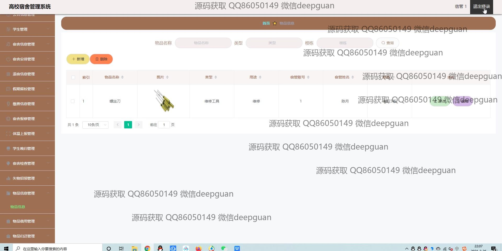

<h1 align="center">的高校学生宿舍管理系统vue</h1>

## 简介
高校学生宿舍管理系统：角色分为管理员、学生；功能包括学生信息管理、宿舍安排管理、退宿管理、公告管理、体温上报、宿舍报修、物品借用等。    --计算机毕业设计源码；毕设源码；java毕业设计源码

## 联系方式

<h3 align="center">获取完整代码与数据库文件 + 微信：deepguan QQ: 86050149 QQ群: 783742310</h3>

<h3 align="center">可帮忙远程部署 包运行成功！提供远程部署、修改代码、设计文档指导、代码讲解等服务！</h3>

## 功能介绍（完整见运行截图）
管理员： 登录、注册、退出。系统功能包括个人中心、学生管理、公告信息管理、宿舍信息管理、宿舍安排、退宿信息管理、体温上报、维修管理、物品借用和宿舍安排管理。可以通过导航栏快速访问不同模块。提供用户信息录入、修改、删除及对信息进行详情查看、安排、审核等操作。支持宿舍检查信息、晚归登记、体温上报、报修信息等记录和查询。

学生： 登录、注册、退出。查看和修改个人信息，包括学号、姓名、联系方式、宿舍号等。可通过系统中宿舍安排功能查看宿舍安排信息及申请更改，提交体温上报及健康管理相关信息，并进行晚归登记、物品借用等。支持查看公告、查看和修改个人中心信息，并可进行宿舍报修申请。

宿管： 登录、注册、退出。全面管理宿舍信息，包括宿舍安排、信息录入、编辑和删除。记录和追踪学生体温、晚归情况及其他相关事务。审核和更新宿舍申请、退宿信息，以及管理维修请求和物品借用。确保宿舍管理系统高效运作，维护宿舍环境和秩序。

管理员辅助人员： 协助收集和上传学生宿舍相关图片或文件，如宿舍布局、学生照片等，通过文件选择界面管理，提升信息的可视化管理。同时协助审核及导出宿舍信息，管理学生及宿舍长的基本信息，维护系统功能正常。

## 运行截图

本代码来源于网络,仅供学习参考使用!

